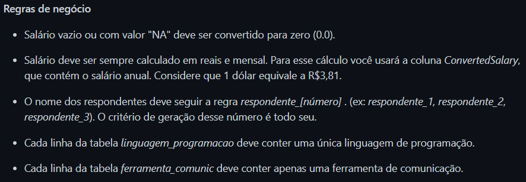
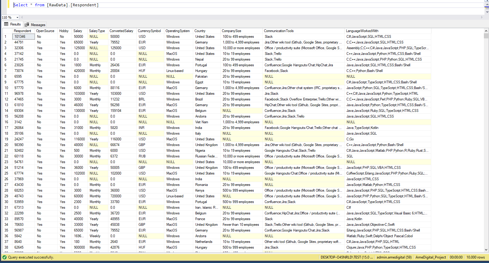
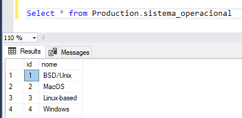
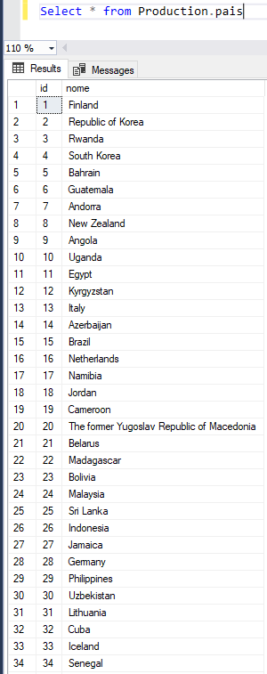
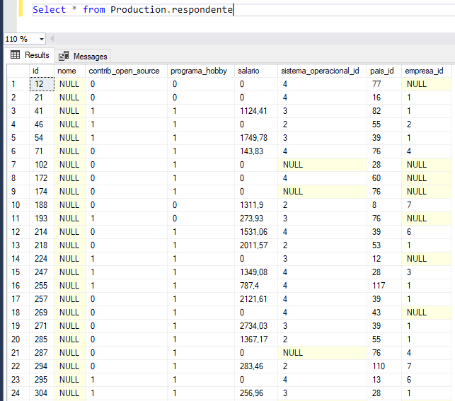
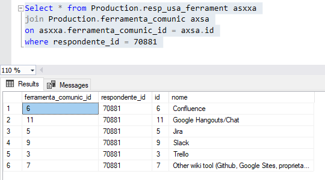
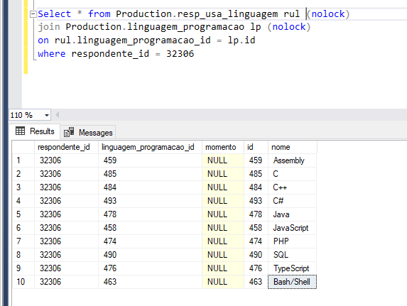
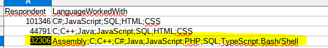

### Repositório Criado para apresentar minha solução para o desafio <a href="https://github.com/AmeDigital/challenge-data-engineer" target="_blank">AmeDigital</a>

A primeira etapa do desafio foi criar um banco de dados relacional baseado no arquivo "base_de_respostas_10k_amostra.csv"

Seguindo o modelo proposto abaixo.


E levando em consideração as regras de negócios definidas:



____________________________________________________________________________________________________________________________________________________________________

Neste projeto optei por trabalhar no banco de dados SQL Server.

Para a importação dos dados optei por utilizar o Python, com a biblioteca do pandas.

~~~python
import pandas as pd
import pyodbc
import conf as conf

data = pd.read_csv(r'D:\Projects\AmeDigital_MySolution\File\base_de_respostas_10k_amostra.csv')

df = pd.DataFrame(data, columns= ['Respondent', 'Hobby', 'OpenSource', 'Country', 'Student', 'Employment', 'FormalEducation', 'UndergradMajor', 'CompanySize', 'DevType', 'YearsCoding', 'YearsCodingProf', \
  'JobSatisfaction', 'CareerSatisfaction', 'HopeFiveYears', 'JobSearchStatus', 'LastNewJob', 'AssessJob1', 'AssessJob2', 'AssessJob3', 'AssessJob4', 'AssessJob5', 'AssessJob6', 'AssessJob7', 'AssessJob8', \
  'AssessJob9', 'AssessJob10', 'AssessBenefits1', 'AssessBenefits2', 'AssessBenefits3', 'AssessBenefits4', 'AssessBenefits5', 'AssessBenefits6', 'AssessBenefits7', 'AssessBenefits8', 'AssessBenefits9', \
  'AssessBenefits10', 'AssessBenefits11', 'JobContactPriorities1', 'JobContactPriorities2', 'JobContactPriorities3', 'JobContactPriorities4', 'JobContactPriorities5', 'JobEmailPriorities1', 'JobEmailPriorities2', \
  'JobEmailPriorities3', 'JobEmailPriorities4', 'JobEmailPriorities5', 'JobEmailPriorities6', 'JobEmailPriorities7', 'UpdateCV', 'Currency', 'Salary', 'SalaryType', 'ConvertedSalary', 'CurrencySymbol', 'CommunicationTools', \
  'TimeFullyProductive', 'EducationTypes', 'SelfTaughtTypes', 'TimeAfterBootcamp', 'HackathonReasons', 'AgreeDisagree1', 'AgreeDisagree2', 'AgreeDisagree3', 'LanguageWorkedWith', 'LanguageDesireNextYear', 'DatabaseWorkedWith', \
  'DatabaseDesireNextYear', 'PlatformWorkedWith', 'PlatformDesireNextYear', 'FrameworkWorkedWith', 'FrameworkDesireNextYear', 'IDE', 'OperatingSystem', 'NumberMonitors', 'Methodology', 'VersionControl', 'CheckInCode', 'AdBlocker', \
  'AdBlockerDisable', 'AdBlockerReasons', 'AdsAgreeDisagree1', 'AdsAgreeDisagree2', 'AdsAgreeDisagree3', 'AdsActions', 'AdsPriorities1', 'AdsPriorities2', 'AdsPriorities3', 'AdsPriorities4', 'AdsPriorities5', 'AdsPriorities6', 'AdsPriorities7', \
  'AIDangerous', 'AIInteresting', 'AIResponsible', 'AIFuture', 'EthicsChoice', 'EthicsReport', 'EthicsResponsible', 'EthicalImplications', 'StackOverflowRecommend', 'StackOverflowVisit', 'StackOverflowHasAccount', 'StackOverflowParticipate', \
  'StackOverflowJobs', 'StackOverflowDevStory', 'StackOverflowJobsRecommend', 'StackOverflowConsiderMember', 'HypotheticalTools1', 'HypotheticalTools2', 'HypotheticalTools3', 'HypotheticalTools4', 'HypotheticalTools5', 'WakeTime', 'HoursComputer', \
  'HoursOutside', 'SkipMeals', 'ErgonomicDevices', 'Exercise', 'Gender', 'SexualOrientation', 'EducationParents', 'RaceEthnicity', 'Age', 'Dependents', 'MilitaryUS', 'SurveyTooLong', 'SurveyEasy'])

# Connection with database

server = credentials[0]
database = credentials[1]
username = credentials[2]
password = credentials[3]
cnxn = pyodbc.connect('DRIVER={SQL Server};SERVER='+server+';DATABASE='+database+';UID='+username+';PWD='+ password)
cursor = cnxn.cursor()

# Insert the data

cursor = cnxn.cursor()

# Limpa a tabela
cursor.execute("TRUNCATE TABLE RawData.Respondent")

# Salário vazio ou com valor "NA" deve ser convertido para zero (0.0).

df["Salary"].fillna("0.0", inplace=True)
df["SalaryType"].fillna("null", inplace=True)
df["ConvertedSalary"].fillna("0.0", inplace=True)
df["CurrencySymbol"].fillna("null", inplace=True)
df["OperatingSystem"].fillna("null", inplace=True)
df["Country"].fillna("null", inplace=True)
df["CompanySize"].fillna("null", inplace=True)
df["CommunicationTools"].fillna("null", inplace=True)
df["LanguageWorkedWith"].fillna("null", inplace=True)

# Insert Dataframe into SQL Server:
for index, row in df.iterrows():

  cursor.execute("INSERT INTO RawData.Respondent (Respondent, OpenSource, Hobby, Salary, SalaryType, ConvertedSalary, CurrencySymbol, OperatingSystem, Country, CompanySize, CommunicationTools, LanguageWorkedWith) values (?, ?, ?, ?, ?, ?, ?, ?, ?, ?, ?, ?)",
  row.Respondent, row.OpenSource, row.Hobby, row.Salary, row.SalaryType, row.ConvertedSalary, row.CurrencySymbol, row.OperatingSystem, row.Country, row.CompanySize, row.CommunicationTools, row.LanguageWorkedWith)

cnxn.commit()
cursor.close()

~~~

Eu obtei por fazer ELT (Extract, Load, Transform) então, carreguei o arquivo ".csv" no formato original e foi realizando os tratamentos antes de colocar na tabela final.



Com o arquivo no banco de dados, começei a trabalhar na arquitetura das tabelas do modelo ER

```

BEGIN TRANSACTION

--Select c from RawData.Respondent

drop table if exists Production.respondente 
drop table if exists Production.sistema_operacional 
drop table if exists Production.pais 
drop table if exists Production.empresa 


-- Converte o texto null para nulo.
Update RawData.Respondent set OpenSource = null where OpenSource = 'null'
Update RawData.Respondent set Hobby = null where OpenSource = 'null'
Update RawData.Respondent set SalaryType = null where SalaryType = 'null'
Update RawData.Respondent set CurrencySymbol = null where CurrencySymbol = 'null'
Update RawData.Respondent set OperatingSystem = null where OperatingSystem = 'null'
Update RawData.Respondent set Country = null where Country = 'null'
Update RawData.Respondent set CompanySize = null where CompanySize = 'null'
Update RawData.Respondent set CommunicationTools = null where CommunicationTools = 'null'
Update RawData.Respondent set LanguageWorkedWith = null where LanguageWorkedWith = 'null'

Create table Production.sistema_operacional (

id int identity primary key,
nome varchar(255))

Insert into Production.sistema_operacional (nome) 
Select distinct OperatingSystem from RawData.Respondent where OperatingSystem is not null

-- Select * from Production.sistema_operacional

----------------------------------------------------------------------------------------------------------------
----------------------------------------------------------------------------------------------------------------

Create table Production.pais (
id int identity primary key,
nome varchar(255))

Insert into Production.pais (nome)
Select distinct Country from RawData.Respondent where Country is not null

-- Select * from Production.pais

----------------------------------------------------------------------------------------------------------------
----------------------------------------------------------------------------------------------------------------

Create table Production.empresa (
id int identity primary key,
tamanho varchar(255))

Insert into Production.empresa (tamanho)
Select distinct CompanySize from RawData.Respondent where CompanySize is not null

-- Select * from Production.empresa

----------------------------------------------------------------------------------------------------------------
----------------------------------------------------------------------------------------------------------------


Create table Production.respondente (
id int primary key,
nome varchar(255),
contrib_open_source bit,
programa_hobby bit,
salario float,
sistema_operacional_id int,
pais_id int,
empresa_id int)

-- Adicionando as FK's

Alter table Production.respondente
Add foreign key (sistema_operacional_id) references Production.sistema_operacional(id)

Alter table Production.respondente
Add foreign key (pais_id) references Production.pais(id)

Alter table Production.respondente
Add foreign key (empresa_id) references Production.empresa(id)

Insert into Production.respondente (id, nome, contrib_open_source, programa_hobby, salario, sistema_operacional_id, pais_id, empresa_id)

Select Respondent as [id], null as [nome], case when OpenSource = 'Yes' then 1 else 0 end as [contrib_open_source],
case when Hobby = 'Yes' then 1 else 0 end as programa_hobby,
round(((convert(float,ConvertedSalary) / 3.81) / 12), 2) as [salario],
so.id as [sistema_operacional_id],
p.id as [pais_id],
e.id as [empresa_id]

from RawData.Respondent r (nolock)
left join Production.sistema_operacional so (nolock)
on r.OperatingSystem = so.nome
left join Production.pais p (nolock)
on r.Country = p.nome
left join Production.empresa e (nolock)
on r.CompanySize = e.tamanho

--Select * from Production.respondente


IF @@ERROR = 0
COMMIT
ELSE
ROLLBACK

```

As tabelas desta forma no banco de dados








#### Para resolver o desafio a seguir:

> Cada linha da tabela ferramenta_comunic deve conter apenas uma ferramenta de comunicação.

Eu optei por criar um script python no qual ele primeiro irá identificar todas as possibilidades de ferramentas de comuninicação, 
após isso salvar no banco de dados SQL e após isso, ir atribuindo os respesctivos ID aos respondentes.

~~~python

import pandas as pd
import pyodbc
import conf as conf

credentials = conf.credentials()

server = credentials[0]
database = credentials[1]
username = credentials[2]
password = credentials[3]
cnxn = pyodbc.connect('DRIVER={SQL Server};SERVER='+server+';DATABASE='+database+';UID='+username+';PWD='+ password)
cursor = cnxn.cursor()

# Open the cursor
cursor = cnxn.cursor()

# This variable will receive the name of the unique communication tools 
unique_tools = set()
# This list will receive all communication tools
list_of_communicationstools = []

query =  cursor.execute("Select distinct Respondent, CommunicationTools from [RawData].[Respondent] where CommunicationTools is not null order by Respondent asc")

# For each row will append the respondet and his communication tools
for row in query:
    x = { 
        'Respondent' : row[0],
        'Tools' : row[1]
        }
    list_of_communicationstools.append(x)

# Passing for all the tools
for tool in list_of_communicationstools:
    list_of_tool = tool['Tools'].split(';')
    for tool in list_of_tool:
        unique_tools.add(tool)

# Clear the table ferramenta_comunic
cursor.execute("Truncate table Production.ferramenta_comunic")

# Insert the unique communication tools
for tool in unique_tools:
    cursor.execute("Insert into Production.ferramenta_comunic (nome) values (?)", tool) 

#########################################################################################

# Clear the table ferramenta_comunic
cursor.execute("Truncate table Production.resp_usa_ferrament")

# This second part relates the respondent to the ID's of the tools that he uses

# Receive a list with the ID and the Tool
tool_id = cursor.execute("Select * from Production.ferramenta_comunic")

ferramenta_comunic = []

for x in tool_id:
    ferramenta_comunic.append(x)

resp_usa_ferramenta = []

for row in list_of_communicationstools:

    list_of_tool = row['Tools'].split(';')
    
    for tool in list_of_tool:

        x = {
            'Respondent' : row['Respondent'],
            'ID' : tool
            }

        resp_usa_ferramenta.append(x)


# Convert the name to the ID
for x in resp_usa_ferramenta:
    for y in ferramenta_comunic:
        if x['ID'] == y[1]:
            x['ID'] = y[0]
            break

# Insert this into SQL 
for id in resp_usa_ferramenta:
    cursor.execute("Insert into Production.resp_usa_ferrament (ferramenta_comunic_id, respondente_id) values (?, ?)", id['ID'], id['Respondent'])

cnxn.commit()
cursor.close()

print('Carga concluida com sucesso!')

~~~

Para as tabelas abaixo:

```

DROP TABLE IF EXISTS Production.ferramenta_comunic 

Create table Production.ferramenta_comunic  (

id int identity primary key,
nome varchar(255)
)

GO

DROP TABLE IF EXISTS Production.resp_usa_ferrament

Create table Production.resp_usa_ferrament  (

ferramenta_comunic_id int,
respondente_id int

)

```

O resultado final ficou assim:



Para o requisito de negócio abaixo a regra que apliquei foi bastante similiar:

> Cada linha da tabela linguagem_programacao deve conter uma única linguagem de programação.

Através do Python eu separei as linguagem dististas, e após isso criei o relacionamento entre o respondente (respondente_id) e a linguagem (linguagem_programacao_id)

~~~python
import pandas as pd
import pyodbc
import conf as conf

credentials = conf.credentials()

server = credentials[0]
database = credentials[1]
username = credentials[2]
password = credentials[3]
cnxn = pyodbc.connect('DRIVER={SQL Server};SERVER='+server+';DATABASE='+database+';UID='+username+';PWD='+ password)
cursor = cnxn.cursor()

# Open the cursor
cursor = cnxn.cursor()

# This variable will receive the uniques programming language names.
all_programming_language = set()

# This variable will receive the ID of the respodent and the ID of the Programming Languages
resp_usa_linguagem = list()

# Convert the object pyodbc in a list
list_of_languages = list(cursor.execute("Select distinct Respondent, LanguageWorkedWith from [RawData].[Respondent] where LanguageWorkedWith is not null order by Respondent asc"))

for row in list_of_languages:
    
    languages = row[1].split(';')
    
    for language in languages:
        # Assigning the distinct programming languages to the set.
        all_programming_language.add(language)

        # Creating the relation between the respondent and the programming languages that he uses.
        x = {
        'respondente_id' : row[0],
        'linguagem_programacao_id' : language
        }

        resp_usa_linguagem.append(x)

# Clear the table resp_usa_linguagem
cursor.execute("Truncate table Production.resp_usa_linguagem")

# Clear the table linguagem_programacao
cursor.execute("delete from Production.linguagem_programacao")

for programming_language in all_programming_language:
    # Insert the distinct programming language on the table.
    cursor.execute("Insert into Production.linguagem_programacao (nome) values (?)", programming_language) 

list_of_languages_with_id = list(cursor.execute("Select * from Production.linguagem_programacao"))

for row in resp_usa_linguagem:
    
    for language in list_of_languages_with_id:
        
        if row['linguagem_programacao_id'] == language[1]:
            row['linguagem_programacao_id'] = language[0]
            break

for row in resp_usa_linguagem:
    cursor.execute("Insert into Production.resp_usa_linguagem (respondente_id, linguagem_programacao_id) values (?, ?)", row['respondente_id'], row['linguagem_programacao_id'])

cnxn.commit()
cursor.close()
~~~

No SQL Server eu havia criado as tabelas:

```
drop table if exists Production.linguagem_programacao 

create table Production.linguagem_programacao (

id int identity primary key not null,
nome varchar(255)
)


drop table if exists Production.resp_usa_linguagem 

create table Production.resp_usa_linguagem (
respondente_id int,
linguagem_programacao_id int,
momento bit

)

alter table Production.resp_usa_linguagem
add foreign key (respondente_id) references Production.respondente(id)

alter table Production.resp_usa_linguagem
add foreign key (linguagem_programacao_id) references Production.linguagem_programacao(id)

```

O resultado ficou assim:



Comparando com o arquivo ".csv"




